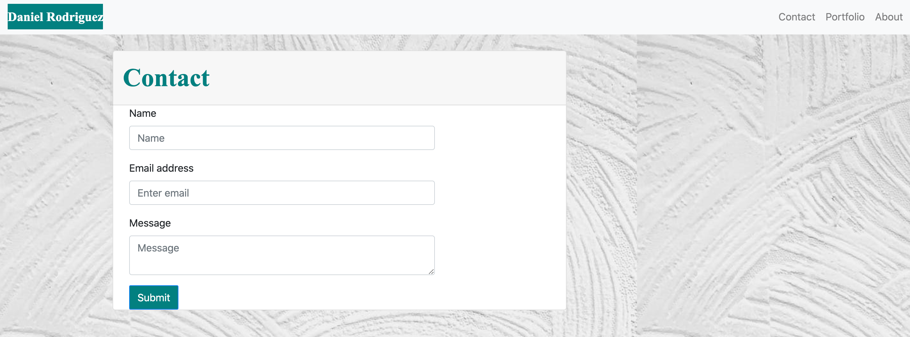
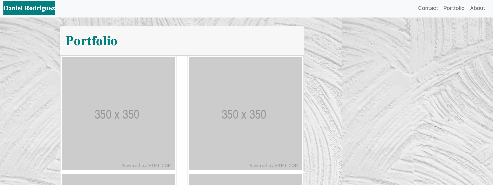
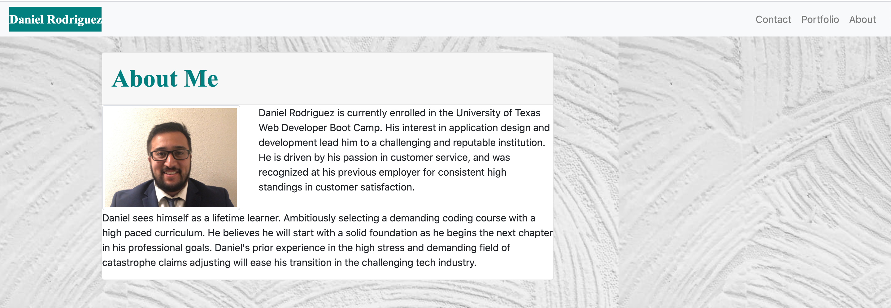

# Portfolio-Bootstrap
In this repo you will find a portfolio outlining a few details about myself and my career goals
- I used both html/css to build my portfolio
- Bootstrap CSS was new to me and also an important part of my build

What I learned:
- All my pages started with a NavBar from bootsrap. I was able to apply these to all my pages without any issues. 
- container, row, column was critical in the layout of my pages. I first tried to use the cards and other items in bootstrap from the start, but in order to get my layout working properly I had to do it from scratch and then go back to the bootstrap components
- double and triple checking your lines after writing them is better to do after each line then after you think you complete the whole document. I loss time fixing minor issues that if I caught earlier I wouldn't have wasted that time and less headaches. 

The personal portfolio is very important and I will continue to build and expand this repo!

